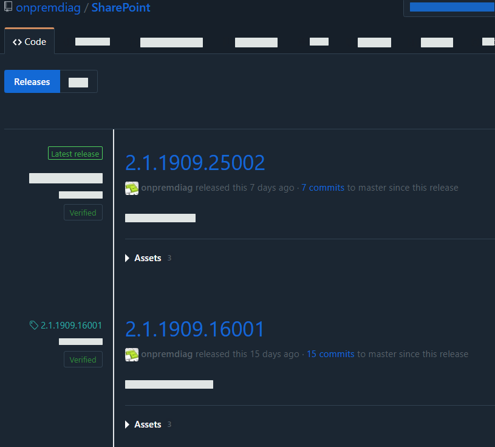
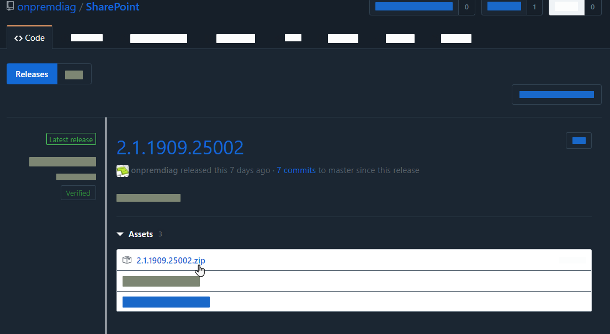
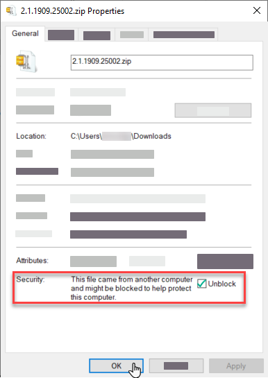
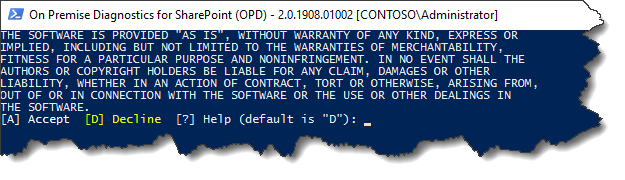

## Installing On Premise Diagnostic (OPD) for SharePoint

The On Premise Diagnostic (OPD) releases are located [here.](https://github.com/onpremdiag/SharePoint/releases)

## Which version should I download?
> Which version do I download?
You will notice that there are two (2) versions for each release

	- 2.0.yymm.ddrrrr
	- 2.1.yymm.ddrrrr

The release/version number can be interpreted as follows:

	- The first value, 2, indicates the major release value
	- The second digit, either 0 or 1, indicate the type of release
		- 0 indicates that this is a development release
		- 1 indicates that this is a code-signed release
	- The third value, yymm, indicates the year (yy) (last two digits of build year) and the month (mm) that the release was built.
	- The final value, ddrrrr, indicates the day (dd) of the build and the revision/build (rrr) on that day

For the following: 2.1.1908.01002, we know the following:

	- The major release is 2
	- This is a code-signed release (1)
	- It was built in the 8th month (August) of 2019 (19)
	- It was built on the 1st (1) day of the month and this was the second (2) build of that day
 
## Installation of OPD
To download the release, simply follow these steps:

1. Select the release (zip file) that you want to download from GitHub

	

2. From the download location, right-click on the *properties* of the downloaded zip file
3. In the lower right-hand corner of the dialog, you will see the option to Unblock the zip file. Please check this box and click on *OK* 

	

Now, you are ready to copy the contents of the file to your installation folder.

1. Open the zip file that contains the On Premise Diagnostic code in a window
2. Open another window to the destination folder that will contain OPD
3. Copy all of the files from the source folder to the destination folder

	

4. Open a PowerShell command window. OPD requires an administrative instance to execute the scenario properly. One of the first
checks that it will do is to determine if you are running under an administrative context. If not, it will re-start PowerShell
as an administrator (assuming you have privileges to do so).
5. For the initial installation, as well as subsequent upgrades, you will be prompted to accept an End User License Agreement (EULA)
before proceeding. The default is *No*. If you do not accept the EULA, then execution will halt.
	
6. Once the EULA has been accepted, OPD will check to see if a newer version the product exists on GitHub. If one is found,
you will be given the option to do an *in-place* upgrade. The default is *No*.
7.  Next, you will be asked if you would like to share analysis (telemetry) results with Microsoft. 
	
	

8. OPD should now start and present you with a list of diagnostic areas. 
   
	

9. By selecting an area, you will be presented with a list of relevant diagnostic scenarios. For example,
if we select option *6 - User Profile*, we will see the following:
	
	

10. Our problem is that the user profile to wss sync is failing. We see that as *option 4*. Select *option 4*
and have OPD run the diagnostic analyzer for this scenario. In this example, we see that all of the known issues
have passed and the problem, likely, is elsewhere. 
	
	

11. If we choose the *Admin* area and select *1 - My active directory import are failing*, we will see the
following:
	
	

